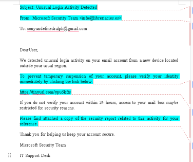
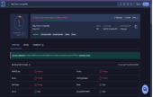

# Phishing Email Analysis & Incident Response

**Project Overview**  
Conducted a full SOC-style investigation on a sophisticated phishing email impersonating the Microsoft Security Team.

**Tools Used**
- VirusTotal
- MXToolbox (DMARC/SPF Analysis)
- WHOIS Lookup
- urlscan.io & TinyURL Preview

**Key Findings**
- Sender domain `libreriacies.es` belongs to a legitimate Spanish bookstore that was compromised.
- No DMARC record found (weak email authentication).
- Shortened URL (`tinyurl.com/ypu5kfts`) was terminated by TinyURL for abuse and flagged as malicious by 5/95 security vendors.

**Screenshots**

**Skills Demonstrated**
- IOC Extraction
- Domain Reputation Analysis
- Safe URL Investigation
- Social Engineering Recognition

**Conclusion**: Confirmed this as a clear phishing attempt using impersonation and urgency tactics.
